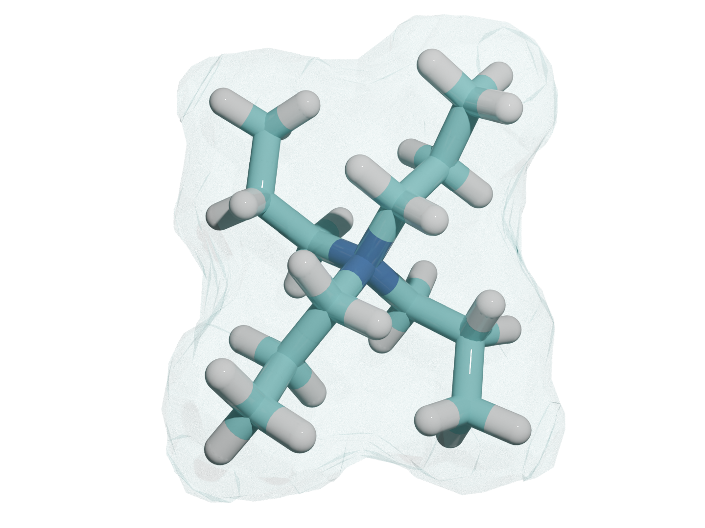
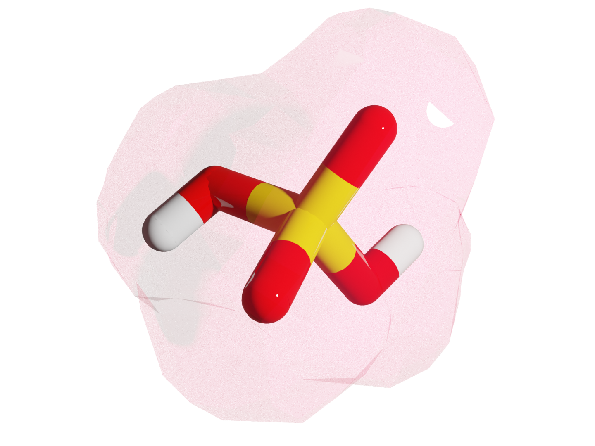
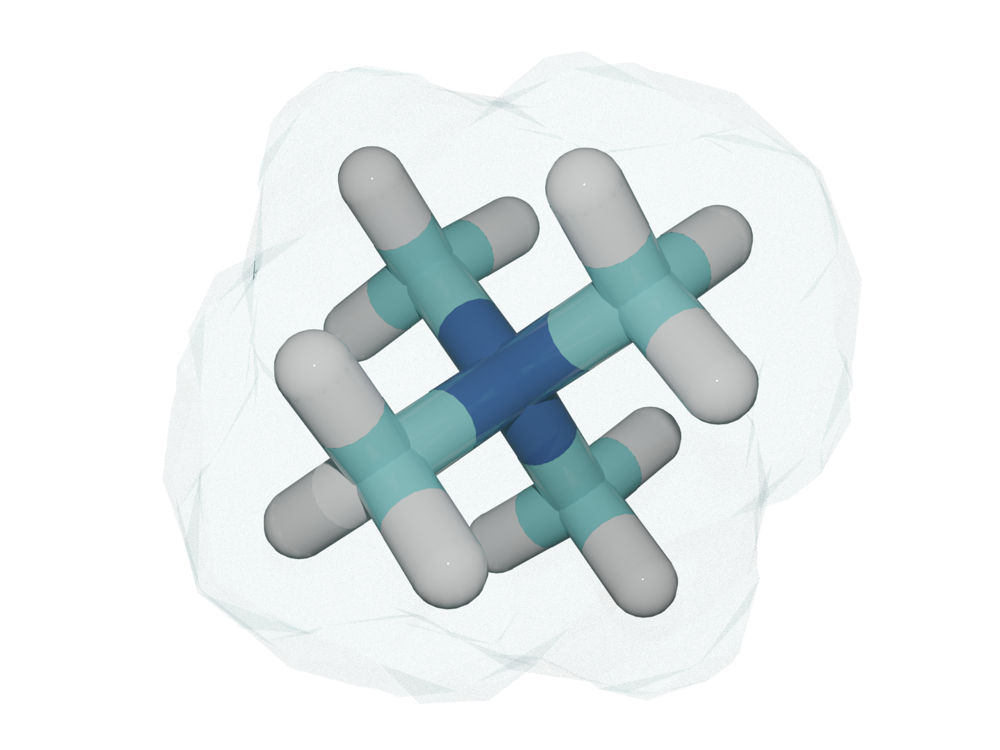
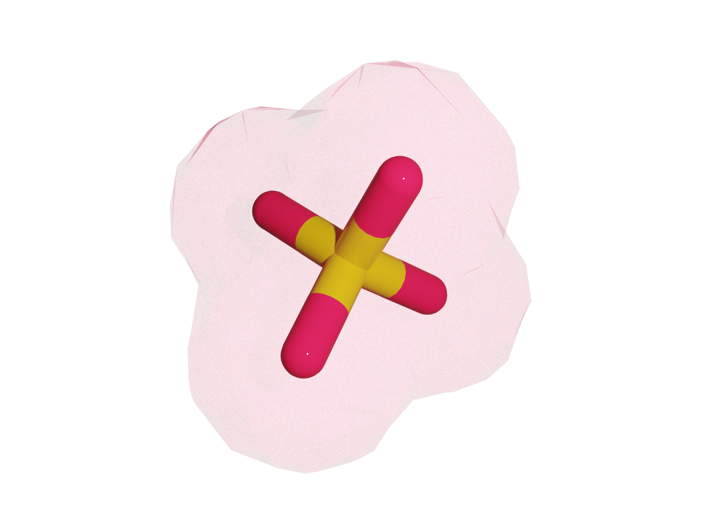

## Quantifying specific ion effects through charge transfer models

</a>
</a>
</a>
</a>

### About
**SIE_descriptors** allows users to predict specific ion effect (SIE) properties through magnitudes extracted from
conceptual DFT to approximate the charge and radius of an ion with or without
perturbed descriptors and using different models of charge transfer in solution.
  </a>  

### Usage
`modules/main.py` contains all the predefined functions to read csv table, do fitting, and custom plots and tables, and `modules/formula.py` includes all the descriptors for modelling $Q$, charge and $R$, size. All scripts in current directory will run execute those functions. `formula_latexify.py` can visualize the 16 formulas in cleaner format. In `csv` directory, energies ($E_{HOMO}$, $E_{LUMO}$, $E_{HOMO_{-1}}$) were ran using the ub3lyp/def2tzvp basis set and property values were gathered from [Gregory et al.](https://pubs.rsc.org/en/content/articlelanding/2021/sc/d1sc03568a)

The naming scheme of files is: `{a}_{b}_{c}_{d}.py`

- `a` all, cat, ani, charge - fitting all ions, cations, anions, or cations/anions respectively.
- `b` 1, formula - reading the script for one or all formulas, respectively. 
- `c` 1, prop - reading the script for one or all properties, respectively.
- `d` plot, table - plot will produce fitted plot or table will produce error analysis and fit values, respectatively.

Stay tuned for the publication!
